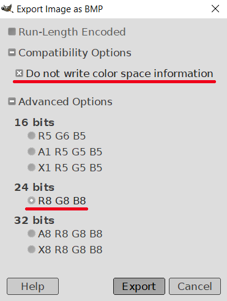

YSmenu_themes
=============
My themes for YSmenu. YSmenu is an alternative free (but closed-source) firmware for R4 cartridges for  Nintendo DS.

For more information, see articles on Wikipedia: 
[R4 cartridge](https://en.wikipedia.org/wiki/R4_cartridge), [Nintendo DS Lite](https://en.wikipedia.org/wiki/Nintendo_DS_Lite), [Nintendo DS](https://en.wikipedia.org/wiki/Nintendo_DS), [Nintendo DSi](https://en.wikipedia.org/wiki/Nintendo_DSi)

## Theme installation

You can simply copy `YSmenu.ini`, `YSMenu2.bmp`, `YSMenu2.bmp` to `<your_SD_card>/TTmenu/`

If you have custom `YSmenu.ini` then *overwrite only sections* `[FILELIST]` and `[FILEINFO]`...

## Tips

You can buy a new "R4 SDHC" card on eBay or AliExpress (At least now, in 2020).

See ["How To Setup An R4 Card"](https://www.youtube.com/watch?v=7yTyDVl1ICc) video on YouTube describing how to install YSmenu

See [Excellent ZX Spectrum emulator ZXDS written by Patrik Rak](http://zxds.raxoft.cz/)

## YSmenu theme files

### `YSmenu.ini`

`YSmenu.ini` uses color codes in an uncommon format BGR15. For converting colors to this format, you can use my simple Python script `html2bgr15.py` For more information run:

    python3 html2bgr15.py --help 

### `YSMenu*.bmp`

BMP images have to be saved in the format:

